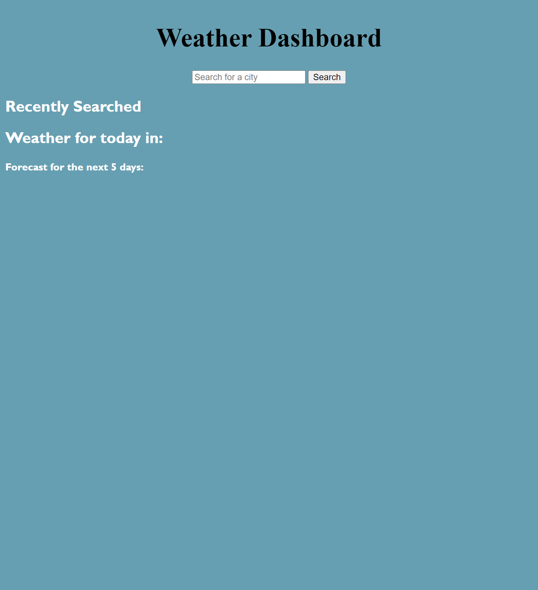
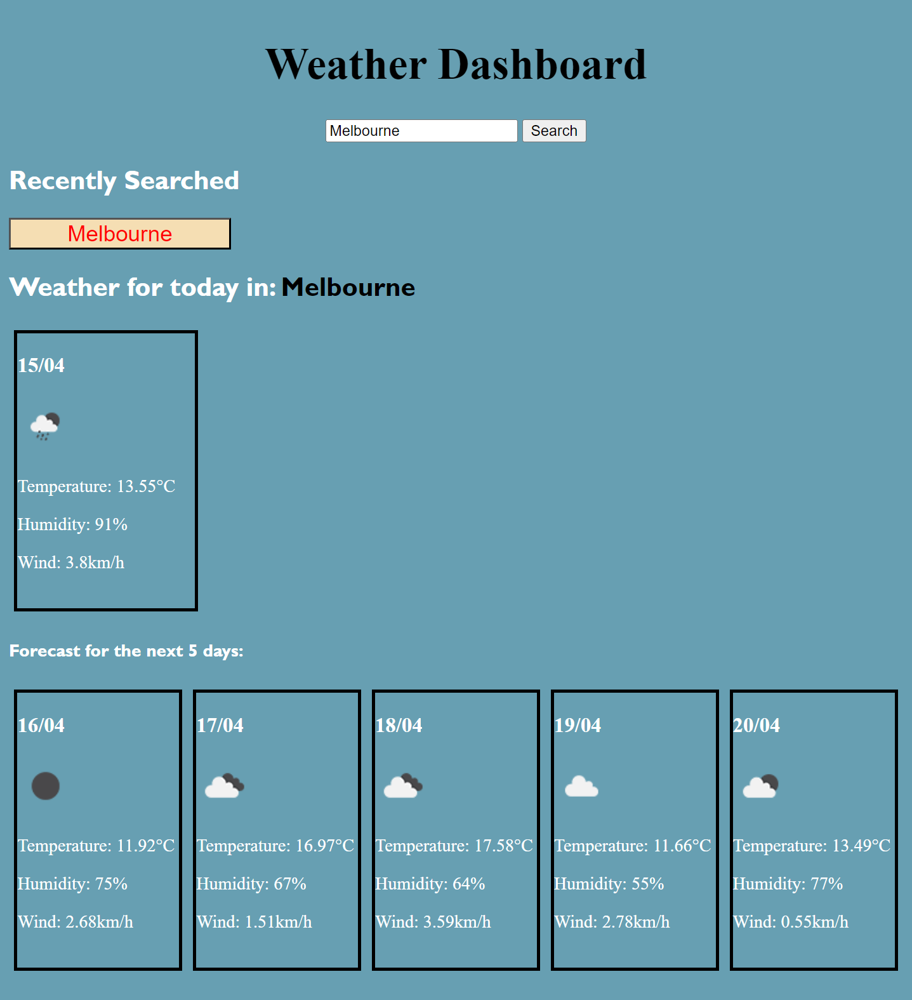
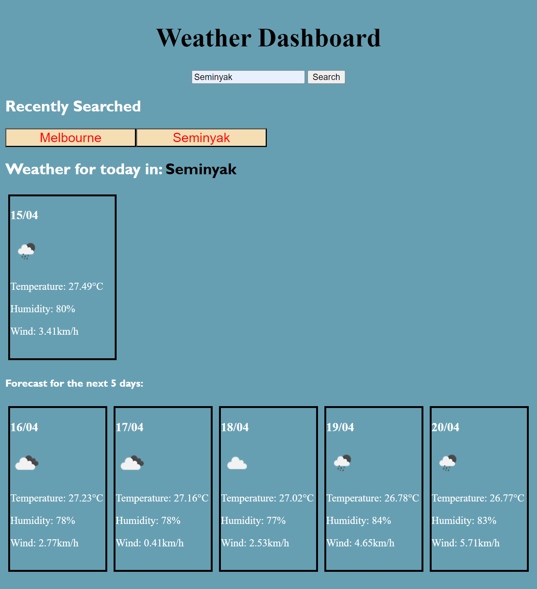
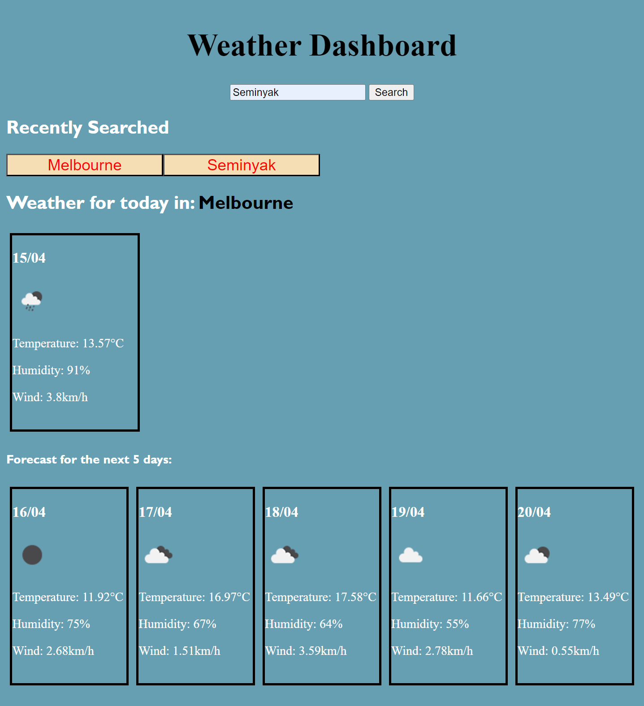

<Weather-Dashboard>

## Deployed Site

## Description
A simple weather dashboard that shows todays forecast and the 5 day forecast for the selected city using OpenWeatherAPI.

## Usage
On deployed site you will be greeted with the landing page

Search for a city in the search bar and click submit
once this is done, the page will look like this. (used Melbourne as an example)

Searched city will then save to Recently Searched, and the local storage and become a button.

If you click on the button, it will go back to the buttons city

